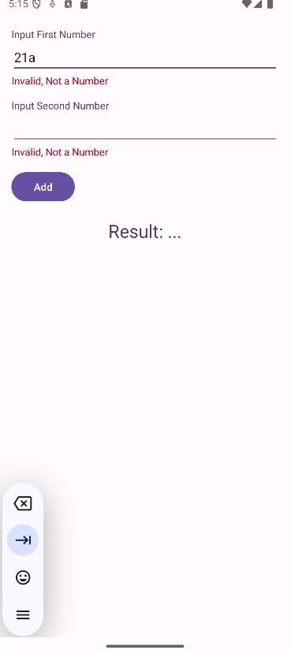
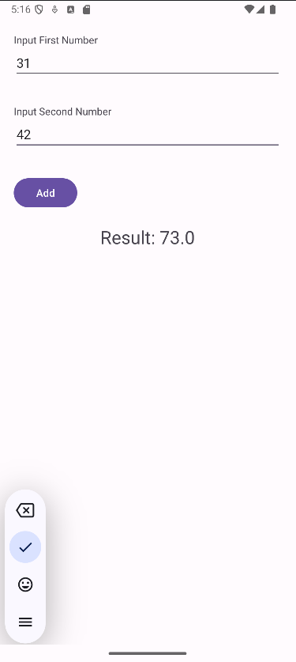

# Calculadora Java y XML

Una sencilla aplicación de Android desarrollada en Java con una interfaz de usuario definida en XML. Permite sumar dos números ingresados por el usuario.

## Características

- **Validación de entradas:** Verifica que las entradas sean números válidos antes de realizar la suma.
- **Diseño amigable:** Interfaz creada usando layouts de XML con estilo moderno.
- **Mensajes de error:** Muestra mensajes claros si las entradas son inválidas.

## Capturas de Pantalla





## Requisitos

- Android Studio Flamingo o superior.
- JDK 17 o superior.
- Dispositivo o emulador con Android 6.0 (API 23) o superior.

## Instalación

1. Clona este repositorio:
   ```bash
   git clone https://github.com/tu-usuario/calculadora-que-suma-java.git
   ```
